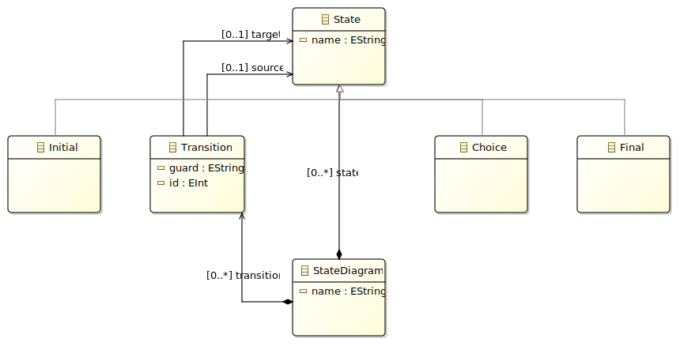

模型转换部分使用Eclipse ATL工具对简化后的UML活动图到UML状态图进行转换，代码生成部分使用Acceleo工具，从简化后的状态图生成Java代码，元模型如下图所示。




#### 1. 转换映射关系

<div>
    <table>
        <thead>
            <tr>
                <th>源模型元素</th>
                <th>目标模型元素</th>
            </tr>
        </thead>
        <tbody>
            <tr>
                <td>ActivityDiagram</td>
                <td>StateDiagram</td>
            </tr>
            <tr>
                <td>Activity</td>
                <td rowspan="4">State</td>
            </tr>
            <tr>
                <td>Fork</td>
            </tr>
            <tr>
                <td>Merge</td>
            </tr>
            <tr>
                <td>Join</td>
            </tr>
            <tr>
                <td>Decision</td>
                <td>Choice</td>
            </tr>
            <tr>
                <td>Initial</td>
                <td>Initial</td>
            </tr>
            <tr>
                <td>Final</td>
                <td>Final</td>
            </tr>
            <tr>
                <td>FlowEdge</td>
                <td>Transition</td>
            </tr>
        </tbody>
    </table>
</div>
代码生成部分使用Acceleo工具，针对前一部分的状态图进行代码生成实验，其中状态图的每个State对应Java代码中State枚举中的一个类型，每一个Transition都生成一个Case用于判断目标状态。

```xml
<?xml version="1.0" encoding="ISO-8859-1"?>
<state:StateDiagram xmi:version="2.0" xmlns:xmi="http://www.omg.org/XMI" xmlns:xsi="http://www.w3.org/2001/XMLSchema-instance" xmlns:state="http://com.hath.state" name="act_diagram">
  <state xsi:type="state:Initial" name="start"/>
  <state xsi:type="state:Final" name="end"/>
  <state name="act1"/>
  <state name="act2"/>
  <state xsi:type="state:Choice" name="dec1"/>
  <state name="act3"/>
  <state name="act4"/>
  <state name="merge1"/>
  <state name="fork1"/>
  <state name="act5"/>
  <state name="act6"/>
  <state name="join1"/>
  <transition source="//@state.0" target="//@state.2" id="1"/>
  <transition source="//@state.2" target="//@state.3" id="2"/>
  <transition source="//@state.3" target="//@state.4" id="3"/>
  <transition source="//@state.4" target="//@state.5" guard="cond2" id="4"/>
  <transition source="//@state.4" target="//@state.6" guard="cond1" id="5"/>
  <transition source="//@state.5" target="//@state.8" id="6"/>
  <transition source="//@state.6" target="//@state.7" id="7"/>
  <transition source="//@state.7" target="//@state.1" id="8"/>
  <transition source="//@state.8" target="//@state.9" id="9"/>
  <transition source="//@state.8" target="//@state.10" id="10"/>
  <transition source="//@state.9" target="//@state.11" id="11"/>
  <transition source="//@state.10" target="//@state.11" id="12"/>
  <transition source="//@state.11" target="//@state.7" id="13"/>
</state:StateDiagram>

```

```Java
public class test_diagram {

    // Enum for States
    public enum State {
        act1, 
        act2, 
        act3, 
        act4, 
        act5, 
        act6, 
        start, 
        end, 
        dec1, 
        merge1, 
        fork1, 
        join1
    }

    // Current State
    private State currentState;

    // Constructor
    public test_diagram() {
        // Set initial state if exists
        this.currentState = State.start;
    }

    // Method to process transitions based on guard conditions
    public void processEvent(String event) {
        switch (currentState) {
            case start:
				currentState = State.act1;
				break;
            case act1:
				currentState = State.act2;
				break;
            case act2:
				currentState = State.dec1;
				break;
            case dec1:
				if ("cond2".equals(event)) {
	                currentState = State.act3;
	                // Transition logic for dec1 -> act3
					break;
                }
            case dec1:
				if ("cond1".equals(event)) {
	                currentState = State.act4;
	                // Transition logic for dec1 -> act4
					break;
                }
            case act3:
				currentState = State.fork1;
				break;
            case act4:
				currentState = State.merge1;
				break;
            case merge1:
				currentState = State.end;
				break;
            case fork1:
				currentState = State.act5;
				break;
            case fork1:
				currentState = State.act6;
				break;
            case act5:
				currentState = State.join1;
				break;
            case act6:
				currentState = State.join1;
				break;
            case join1:
				currentState = State.merge1;
				break;
        }
    }
}
```

